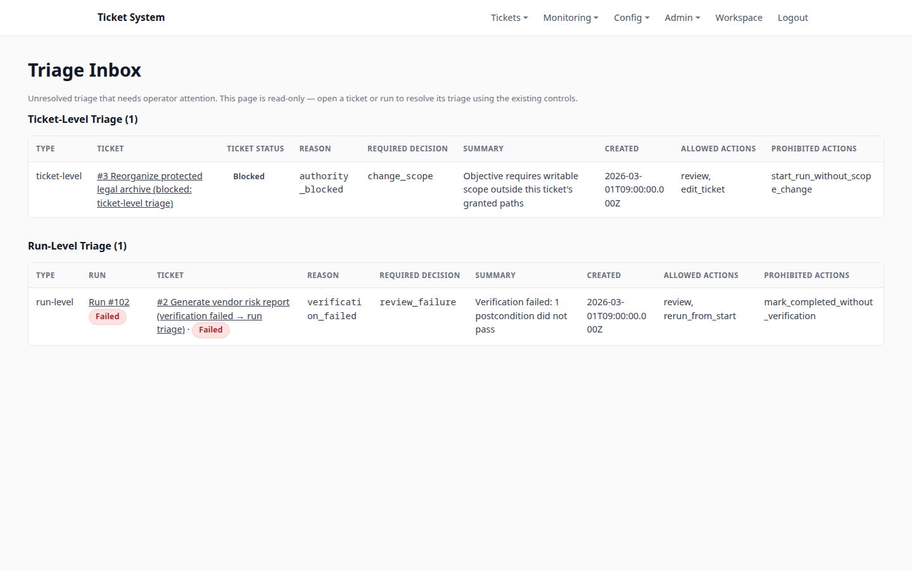

# Ticket System

A server-rendered system for bounded agent work. A ticket assigns responsibility, a run owns one
execution attempt, and every admitted operation passes through authority, evidence, evaluation, and
consequence boundaries.

[Portfolio case study](https://timcis.com/projects/ticket-system)



## System guarantees

The reference implementation demonstrates five reliability properties:

- Persistent state keeps tickets and runs beyond a single model response.
- Scoped authority checks operations against explicit permissions.
- Inspectable evidence records external effects through append-only PostgreSQL events and receipts.
- Independent verification keeps run completion separate from acceptance of the ticket objective.
- Recoverable failure exposes triage, replay, and allowed operator actions without hiding failed work.

## Current architecture

PostgreSQL is the only structured runtime store. It owns tickets, runs, leases, event history,
replay, operation receipts, sessions, catalogs, inbox state, runtime policy, and coordination. The
server has no JSON persistence mode, dual-write path, or legacy runtime-data importer.

The filesystem remains an external target boundary:

- `WORKSPACE_ROOT` is the workspace an authorized run may inspect or mutate.
- `ARTIFACT_ROOT` holds replaceable browser artifacts.
- `data/` and `ARCHIVE/legacy-json-runtime/` are fixtures or historical material, not live server
  authority.

The product is still in development. Completing the persistence cutover does not claim production
security hardening, tenant isolation, managed backups, retention, or hosted-service readiness.

## Runtime flow

`ticket -> run -> PostgreSQL claim/lease -> agent or workflow -> authority check -> target effect ->
transactional evidence/replay/receipt -> evaluation -> consequence -> operator UI/API`

Run admission is coordinated in PostgreSQL across server processes. It uses a short transaction
advisory lock, bounded candidate queries, row leases, and `FOR UPDATE SKIP LOCKED`; it does not
globally serialize execution. Overlapping workspace paths are fenced separately. Process-local
mutation admission protects bounded resources and recovers automatically after pressure falls; it
does not substitute for deployment-wide run admission and does not turn temporary pressure into a
restart-required outage.

## Requirements

- Node.js 24 or newer
- PostgreSQL 17 (the CI baseline), or Docker Compose/Podman Compose for the bundled database
- pnpm 11 is the lockfile/package-manager baseline; npm remains supported for invoking scripts
- One model provider: an OpenAI API key, or a running Ollama installation with a pulled model

## First run

```sh
# If pnpm is not already installed with Node 24:
corepack enable
corepack install

pnpm install --frozen-lockfile
# Skip this when DATABASE_URL points to an existing PostgreSQL 17 database:
pnpm dev:db
pnpm dev:setup
pnpm dev
```

`dev:setup` creates ignored `.env.local` only when absent, applies explicit migrations, and
creates the initial admin when absent and a provider-configured agent when no runnable
agent exists. Interactive
password and OpenAI-key entry is hidden. Existing configuration, users, agents, and credentials are
preserved on repeated runs.

The setup prompt supports OpenAI or Ollama. Non-interactive setup must provide
`OPENAI_API_KEY` plus `OPENAI_MODEL`, or `OLLAMA_MODEL`; `DEV_AGENT_PROVIDER`,
`DEV_AGENT_NAME`, and `OLLAMA_BASE_URL` are optional. Explicit environment variables take
precedence over `.env.local`.

Provider preparation:

- **OpenAI:** run `pnpm dev:setup`, choose `openai`, accept the supported `gpt-4.1-mini`
  default (or enter another enabled model), and enter the API key at the hidden prompt.
- **Ollama:** install Ollama, run `ollama serve`, then `ollama pull <model>`. Confirm the exact tag
  with `ollama list`; enter that tag and the Ollama base URL during `pnpm dev:setup`.

The repository does not create external provider accounts or download model weights implicitly.

`pnpm dev` runs a read-only preflight that verifies the schema, paths, admin, and at least one
provider-configured agent. It never migrates or rotates credentials. Use `pnpm dev:doctor` for the
same checks without starting the server.

In a second terminal, exercise one real provider-backed ticket and verify its workspace effect:

```sh
pnpm dev:smoke
```

A model/provider failure is reported as a failed smoke run with a `codex:trace` command; it is never
converted into a passing result. For general operator work:

```sh
node scripts/oquery.js login --url http://127.0.0.1:3099
node scripts/oquery.js agents --url http://127.0.0.1:3099
node scripts/oquery.js create-ticket --url http://127.0.0.1:3099 --agent 'Developer Agent' --wait --json '<objective>'
npm run codex:trace -- --run <runId>
```

Rotate an existing credential with `pnpm admin:password`; passwords are rejected as command-line
arguments. `ADMIN_BOOTSTRAP_PASSWORD` is creation-only and ignored after the account exists.

## Evidence

The primary evidence surfaces are `/api/runs/:id/state`, `/api/runs/:id/events`,
`/api/runs/:id/decision-graph`, `/api/event-journal`, and `/api/runtime/status`.

## Verification

The release checkpoint requires a disposable PostgreSQL database and creates isolated schemas:

```sh
npm run build
TEST_DATABASE_URL='postgresql://...' npm run checkpoint:release
```

Targeted database checks are available as `test:persistence:postgres`,
`test:cutover:postgres`, and `test:page-render:postgres`. See [docs/SETUP_AND_FIRST_RUN.md](docs/SETUP_AND_FIRST_RUN.md),
[docs/SYSTEM_STATUS.md](docs/SYSTEM_STATUS.md), and
[docs/POSTGRES_CUTOVER.md](docs/POSTGRES_CUTOVER.md).
